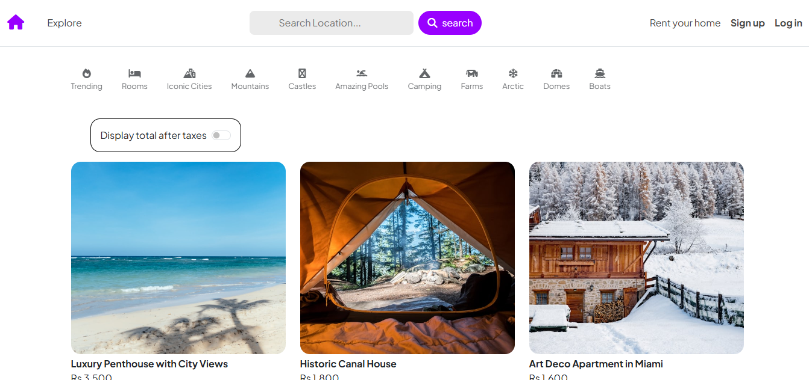

# 🏡 HomeNest – Accommodation Booking Platform  

**HomeNest** is a full-stack accommodation booking platform inspired by Airbnb.  
It allows **users to search, explore, and book accommodations**, while **service providers can list their properties for rent**.  
The project is built using **EJS** for server-side rendering and provides a smooth booking flow for both guests and hosts.  

---

## ⚙️ Tech Stack 

- **Frontend:** EJS, HTML, CSS, JavaScript  
- **Backend:** Node.js, Express.js  
- **Database:** MongoDB  
- **Authentication:** JWT / Passport.js  
- **Deployment:** Vercel / Render / Heroku  

---

## ✨ Features  

### 🔹 For Users (Guests)  
- 🏠 Browse accommodations with details & images  
- 🔍 Search & filter stays by location, price, and type  
- 📅 Book stays with date validation (no overlapping bookings)  
- 💳 Secure booking flow  
- 📱 Responsive design  

### 🔹 For Service Providers (Hosts)  
- 📝 List properties with description, price, and images  
- 🛠 Manage listings (edit or delete)  
- 📊 Track bookings & requests  
- 🔔 Receive notifications for new bookings  

### 🔹 General Features  
- 🔐 Secure authentication (login/signup for both roles)  
- 📦 Role-based dashboards (User / Provider / Admin)  
- 🗺️ Map integration to show property locations  
- 🌍 Scalable modular structure  

---

## 📸 Screenshots

### 🏠 Homepage

👨‍💻 Author

Umair Waheed
📧 [Email](umairmughal78601@gmail.com)
🔗 [Linkedin](https://www.linkedin.com/in/umair-waheed1/)
